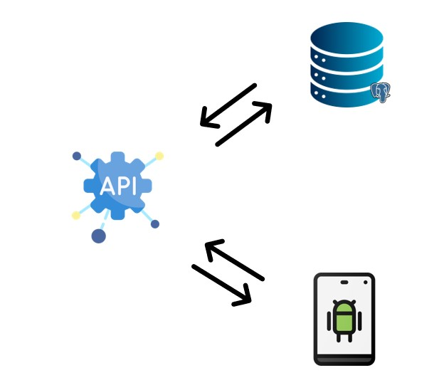
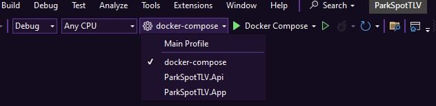
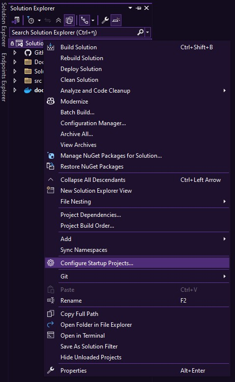
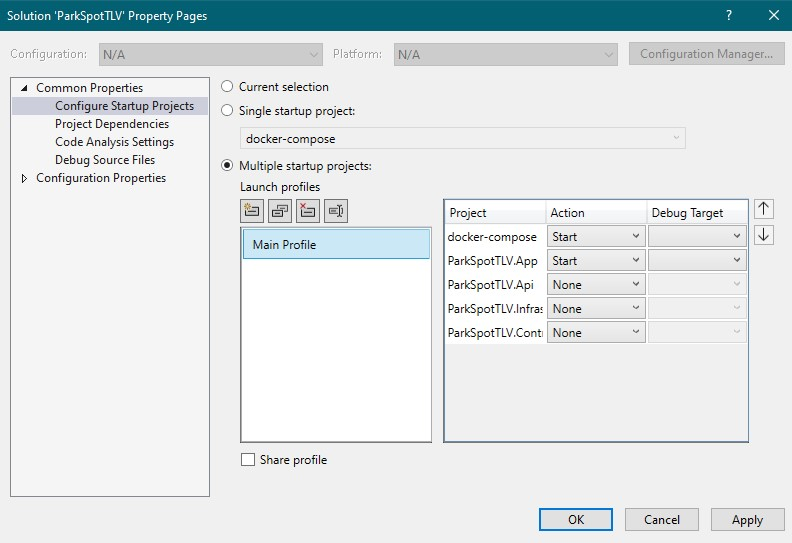
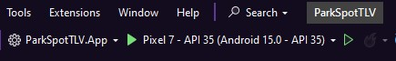
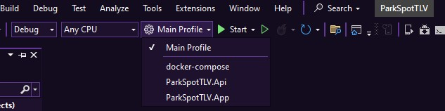
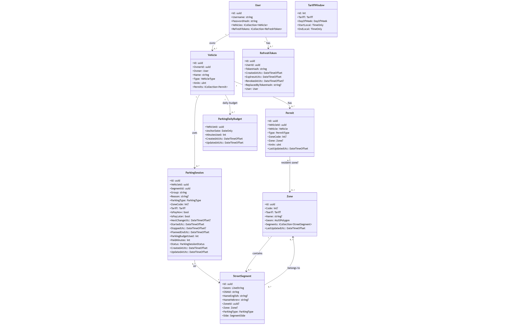

<div align="center">
  
</div>
<h1 align="center">ParkSpotTLV</h1>

<!-- Status & releases -->
[](https://github.com/gwchar2/ParkSpotTLV/actions/workflows/ci.yml)
[](https://github.com/gwchar2/ParkSpotTLV/releases)
[](https://github.com/gwchar2/ParkSpotTLV/releases/latest)
[](./CHANGELOG.md)


## Table of Contents

1. [Project Overview](#project-overview)
2. [System Architecture](#system-architecture)
3. [Getting Started](#getting-started)
4. [Running the Project](#running-the-project)
5. [App Guide](#app-guide)
6. [API Reference](#api-reference)
7. [Database Schema](#database-schema)
8. [Services & Background Jobs](#services--background-jobs)
9. [Security](#security)
10. [Licenses & Credits](#licenses--credits)
11. [Contributing](#contributing)
12. [Future Roadmap](#future-roadmap)
13. [Contact](#contact)

---

## Project Overview

ParkSpot TLV is a **smart parking solution for Tel Aviv**, integrating geospatial data, zone-based parking policies, and mobile convenience. It combines a robust **ASP.NET Core Web API backend**, a **PostGIS-powered database**, and a **.NET MAUI Android app** for a seamless parking experience.

### Key Features

- Real-time zone classification and parking rules
- Interactive map overlays with Google Maps or MapLibre
- Daily parking budget tracking and auto-stop sessions
- Secure authentication using Argon2ID, JWT, and HMAC
- Cross-platform development and containerized deployment

---

## System Architecture
The ParkSpot TLV project is divided into three major components:
1. **Backend API** – ASP.NET Core Web API with EF Core and PostGIS
2. **Database** – PostgreSQL + PostGIS (for spatial data and zone management)
3. **Mobile App** – .NET MAUI Android client with Google Maps integration

<div align="center">
  
</div>

---

## Getting Started

### Prerequisites
- Docker Desktop (Windows/macOS/Linux)
- .NET 9 SDK
- Visual Studio 2022 or VS Code
- Android SDK (for mobile app build)
- A physical Android phone or emulator capable of installing and running APKs

### Setup

```bash
git clone https://github.com/<your-username>/ParkSpotTLV.git
cd ParkSpotTLV
```

---

## Running the Project
Before approaching the different options, make sure to run from the main folder:
`dotnet build src/backend/ParkSpotTLV.Api/ParkSpotTLV.Api.csproj -c Debug`

### Option 1: Installing the Android APK
1. Download the latest APK from the [**Releases**](https://github.com/gwchar2/ParkSpotTLV/releases/latest) section.
2. Option 1: Transfer the .apk file to your Android device. 
	1. Enable *Install from Unknown Sources*.
	2. Launch **ParkSpot TLV** and sign in.
3. Option 2: Install via terminal 
	1. `adb install -r <path to apk>`
	2. Run the docker project via terminal or visual studio.


### Option 2: Running via Visual Studio
1. Open the solution file `ParkSpotTLV.sln`.

2. Right click on the solution and choose `Configure Startup Projects`.


3. Choose docker-compose and ParkSpotTLV.App projects as the only start options, then click `apply`.


4. Open Android Device Manager, and make sure your Android Emulator is fully loaded & selected as default startup **before** continueing to the next step.


5. Choose your new profile and run.


### Option 3: Running from Terminal / Docker Compose
From the main project folder:
1. Build the Database & API with: `docker compose up --build`
2. Build the App with: `dotnet build src/mobile/ParkSpotTLV.App/ParkSpotTLV.App.csproj -f net9.0-android -c Debug`

Access the backend at: `http://localhost:8080/scalar`

---

## App Guide

### Main Screens
- **Login / Register** – Authenticate securely via the API.
- **Map View** – Displays zones, segments, and live parking status.
- **Start Parking** – Begins a parking session with automatic rules and budget checks.
- **History** – View past parking sessions and charges.
- **Settings** – Manage vehicles, permits, and notifications.

---

## API Reference
All API routes are organized under `/api`.
Authentication uses **JWT access tokens** and **refresh tokens** for renewal.

### Health & Version Endpoints
| Method | Route | Summary |
| ------ | ----- | ------- |
| GET | `/health` | Liveness check |
| GET | `/ready` | Readiness check (DB + PostGIS) |
| GET | `/version` | Version check |

### Authentication Endpoints
| Method | Route | Summary |
| ------ | ----- | ------- |
| POST | `/auth/change-password` | Change Password |
| POST | `/auth/login` | Sign in |
| POST | `/auth/logout` | Log out |
| GET | `/auth/me` | Current user |
| POST | `/auth/refresh` | Refresh access token |
| POST | `/auth/register` | Register new account |

<details>
<summary><strong>Vehicle Requests</strong></summary>

| Method | Route | Summary |
| ------ | ----- | ------- |
| GET | `/vehicles` | List Vehicles |
| POST | `/vehicles` | Add Vehicle |
| DELETE | `/vehicles/{id}` | Delete Vehicle |
| GET | `/vehicles/{id}` | Get Vehicle |
| PATCH | `/vehicles/{id}` | Update Vehicle |

</details>

<details>
<summary><strong>Permit Requests</strong></summary>

| Method | Route | Summary |
| ------ | ----- | ------- |
| GET | `/permits` | List Permits |
| POST | `/permits` | Create Permit |
| DELETE | `/permits/{id}` | Delete Permit |
| GET | `/permits/{id}` | Get Permit |
| PATCH | `/permits/{id}` | Update Permit |

</details>

<details>
<summary><strong>Map Segment Requests</strong></summary>

| Method | Route | Summary |
| ------ | ----- | ------- |
| GET | `/map/segments` | Segments by BBox + time + vehicle |
| GET | `/segments/{id}` | Get Segment |
| GET | `/segments/{id}/rules` | Segment rules at given time |

</details>

<details>
<summary><strong>Parking Related Requests</strong></summary>

| Method | Route | Summary |
| ------ | ----- | ------- |
| GET | `/parking/status` | Active parking status |
| POST | `/parking/start` | Start Parking |
| PATCH | `/parking/{id}/end` | End Parking |
| POST | `/parking/stop` | Stop Parking |

</details>

---

## 🗄️ Database Schema
The system uses PostgreSQL with **PostGIS** for geospatial operations.

### Key Tables
| Table | Description |
|--------|-------------|
| `zones` | Contains all parking zones as `MultiPolygon` geometry |
| `street_segments` | LineString geometries representing streets |
| `vehicles` | User-registered vehicles with permit details |
| `parking_sessions` | Active and past parking sessions |
| `daily_budgets` | Daily allowance and tracking table |
| ... | ParkSpotTLV.Infrastructure/entities for more |



---

## Services & Background Jobs
- **AutoStopParkingService** – Monitors sessions and stops them automatically when exceeding time or rules.
- **DailyBudgetService** – Resets and tracks remaining daily minutes.
- **ClassificationService** – Evaluates the zone type and restrictions.
- **PaymentDecisionService** – Determines whether the session is free, paid, or restricted.

---

## Security
- Passwords are hashed with **Argon2ID**.
- Access tokens are signed via **JWT (HMAC SHA-256)**.
- Refresh tokens are stored securely in the database.
- All communication over **HTTPS**.

---

## Licenses & Credits
This project makes use of the following external resources:
- **OpenStreetMap** data © OpenStreetMap contributors ([https://www.openstreetmap.org/](https://www.openstreetmap.org/))
- **Google Maps API** ([https://mapsplatform.google.com/](https://mapsplatform.google.com/))
- **PostGIS**, **.NET**, and **MAUI** frameworks

All rights reserved © 2025 ParkSpot TLV Team.

License: MIT (or specify your chosen license)

---

## Contributing
Contributions are welcome!
1. Fork the repository
2. Create a feature branch (`git checkout -b feature/my-feature`)
3. Commit your changes
4. Open a pull request

---

## Future Roadmap
- Pinpoint parking accuracy & memory
- Specific road segment information
- Push notifications for parking session reminders
- Payment integration for in-app parking
- Web dashboard for administrators

---

## Contact
For any inquiries, contact:
- **Maintainer:** [Tommer Toledo]
- **Email:** [gwchar2@hotmail.com]
- **GitHub:** [https://github.com/gwchar2](https://github.com/gwchar2)

---

> *This README is a living document — updated continuously as the project evolves.*


